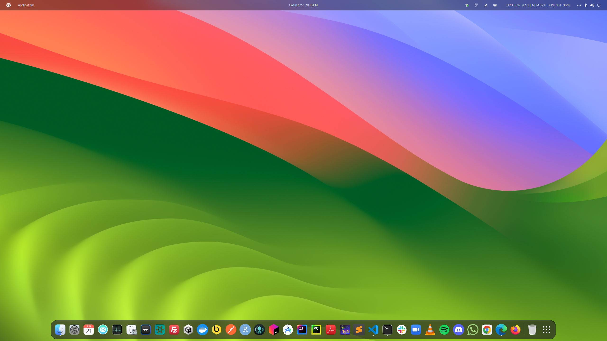
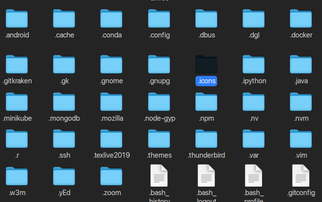
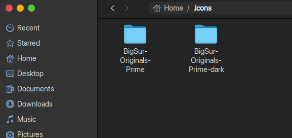
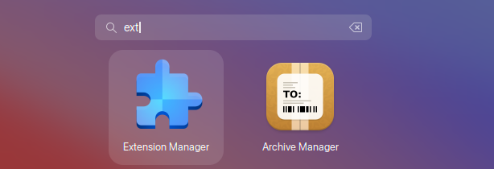
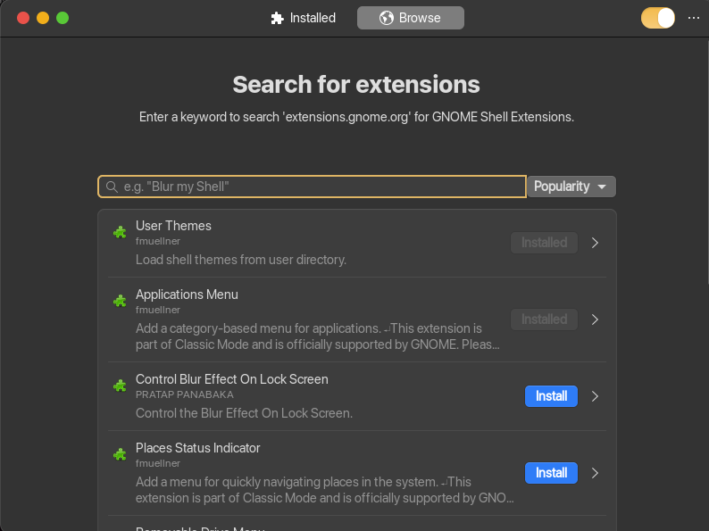
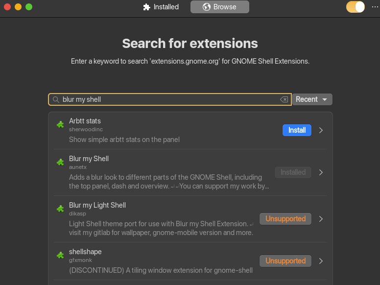
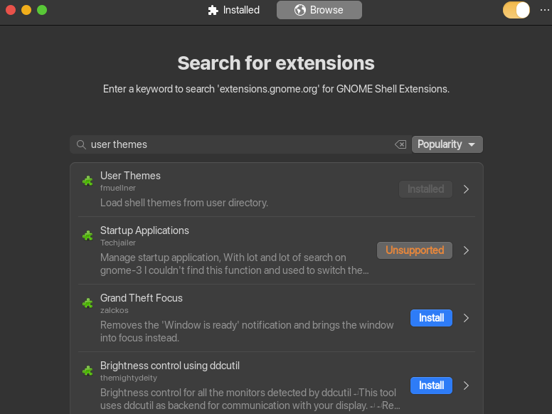
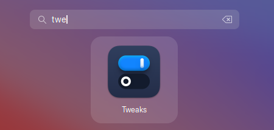
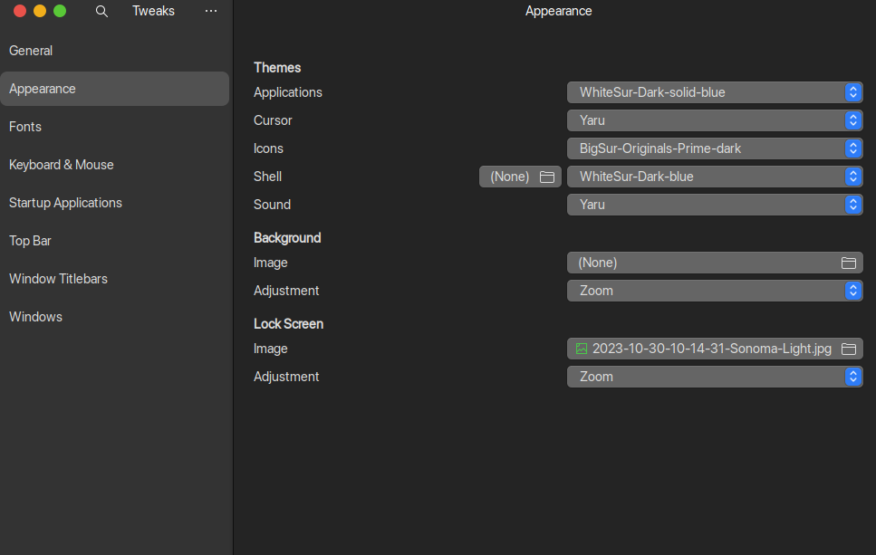
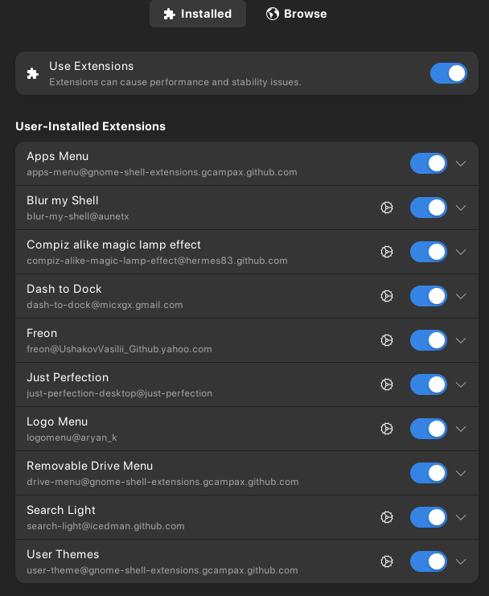

+++
title = 'How to change Ubuntu UI to MacOS-themed'
date = 2024-01-27T18:06:30-05:00
draft = false
+++

In this blog, I will show how to change Ubuntu UI to MacOS alike. Ubuntu is great for work and productivity, but its UI is very basic. Luckily, thanks to the community, there are tools that can tweak Ubuntu UI to look like MacOS. Here is an example of the end result:



First, we need to install `gnome-tweaks` and `gnome-shell-extension-manager`:

```sh
sudo apt install gnome-tweaks gnome-shell-extension-manager
```

Next, clone the [WhiteSur-gtk-theme](https://github.com/vinceliuice/WhiteSur-gtk-theme) repo, open the repo and run the installation script:

```sh
./install.sh
```

The next step is to switch to **mac-themed icons**.
For Ubuntu 22.04, you can install MacOS Icon pack from [https://www.gnome-look.org/p/2023325](https://www.gnome-look.org/p/2023325). Once downloaded, go to your home directory and create a `.icons` folder and move the downloaded icon packs into the folder. You can press `ctrl+h` to view hidden folders in the file browser.

For Ubuntu 24.04, you can also download icons from this repo: [https://github.com/vinceliuice/WhiteSur-icon-theme](https://github.com/vinceliuice/WhiteSur-icon-theme)




Now, let's customize the UI by installing a few extensions. Open `Gnome Extensions Manager`:



Install `blur my shell` and `user themes`:



Open the tweaks app from the app browser and make the following changes:



From here, you can play around with different settings in tweaks and customize it.
Some additional extensions that I recommend include:

* `Apps Menu`: add an app menu in the top bar.
* `Dash to Dock`: make the dock mac-like with customizations.
* `Freon`: add system monitor in the top bar such as CPU temp, fan speed.
* `Logo Menu`: add the Apple logo in the top bar.



Finally, it is time for wall papers.
For **static wallpaper**, you can dowload MacOS wallpapers here: [https://512pixels.net/projects/default-mac-wallpapers-in-5k/](https://512pixels.net/projects/default-mac-wallpapers-in-5k/).

For **dynamic wallpaper**, you can follow the instructions here: [https://github.com/saint-13/Linux_Dynamic_Wallpapers](https://github.com/saint-13/Linux_Dynamic_Wallpapers).

To make the customization even further, you can change the system font to `SF Pro Display`, which is being used in MacOS and unique to Apple. Here is how to do it: [https://www.reddit.com/r/unixporn/comments/4tbc7j/you_can_easily_use_apples_san_francisco_font_in/](https://www.reddit.com/r/unixporn/comments/4tbc7j/you_can_easily_use_apples_san_francisco_font_in/)
