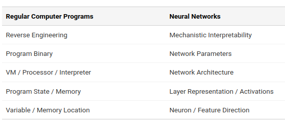
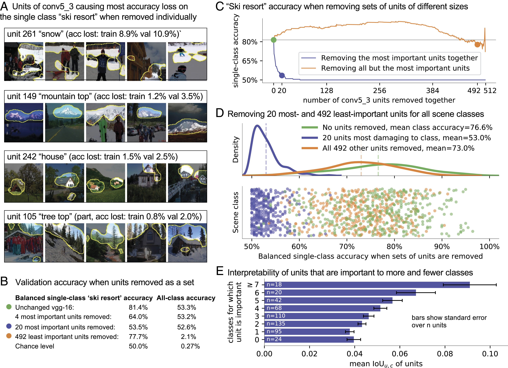
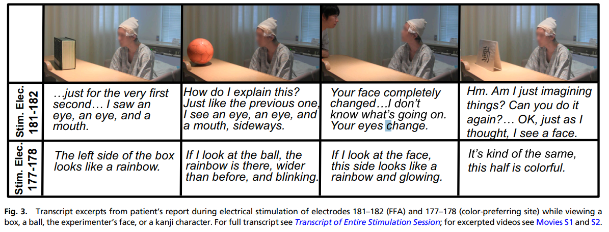

+++
title = 'Mechanisitic Interpretability'
date = 2023-10-18T18:06:30-05:00
draft = false
+++

In this blog, I will introduce a research direction focusing on mechanistic interpretability. This holds significant potential to revolutionize the existing landscape of AI.

[Chris Olah](https://colah.github.io/about.html) drew a compelling analogy when he likened mechanistic interpretability to the process of reverse engineering a compiled binary computer program.

---

**Reverse Engineer Neural Networks**

"Mechanistic interpretability aims to reverse engineer neural networks, much like the process of reverse engineering a compiled binary computer program. In essence, the parameters of a neural network can be viewed as a binary computer program operating on a specialized virtual machine known as a neural network architecture."

---

Some parallels are listed in the table below:

This analogy compring neural networks to computer programs is also used by [David Bau](https://baulab.info/) a dedicated researcher in this field. Before transitioning into academia, David spent a considerable amount of time working in the software industry. During his dissertation defense, David highlighted a significant motivation for pursuing a Ph.D. later in his career — he expressed that, as a software engineer, the lack of understanding about how neural networks operate bothered him, motivating him to delve into deeper research in understand the nook and crany of neural networks. His dissertation defense is [here](http://dissection.csail.mit.edu/) on YouTube, I highly recommend watching it.

Anyways, enough of rumbling, let us dive into the interesting part. Yann LeCun once said "You do not need to know how the human brain works in order to teach a student." This viewpoint reflects a substantial segment of the deep learning community, asserting that deep neural networks are inherently challenging to interpret. Some argue that given their high performance across a multitude of tasks, the question of interpretability might be considered less pressing or relevant. However this "if it ain't broken, don't fix it" feeling towards neural networks is problematic. Especially in the era of LLMs where they can display unexpected behaviors that can be disruptive. I believe mechanisitic interpretability can help us achieve the goal of understanding and controlling AI in that regard.

Ironically, neural networks were not named without purpose. [Bau et al.](https://www.pnas.org/syndication/doi/10.1073/pnas.1907375117) discovered that individual neurons within a CNN network for image classification correspond to distinct objects in the image, such as trees, horses, etc.

Remarkably, [a team of researchers](https://mcgovern.mit.edu/wp-content/uploads/2019/03/Schalk.PNAS2017.pdf) observed that by stimulating human brains, individuals can perceive a black box as various objects. This further gives us the motivation to explore whether such causal effect neurons exist in neural networks.

Here are some key papers in this line of research:

- Locating and Editing Factual Associations in GPT [Meng et al., 2023]
- Mass-Editing Memory In a Transformer [Meng et al., 2023]
- Inference-Time Intervention: Eliciting Truthful Answers from a Language Model [Meng et al., 2023]
- Activation Addition: Steering Language Models Without Optimization [Turner et al., 2023]
- DoLa: Decoding by Contrasting Layers Improves Factuality in Large Language Models [Chuang et al, 2023]
- Representation Engineering: A Top-Down Approach to AI Transparency [Zou et al., 2023]
