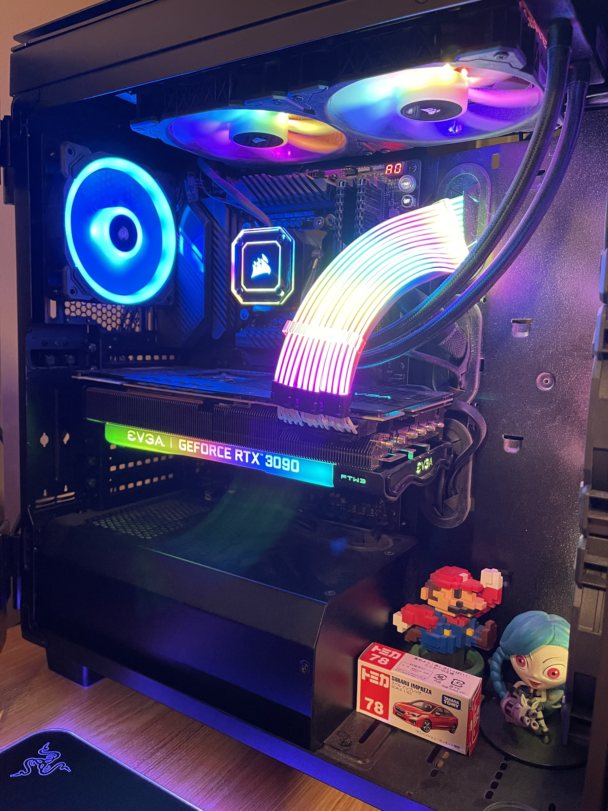
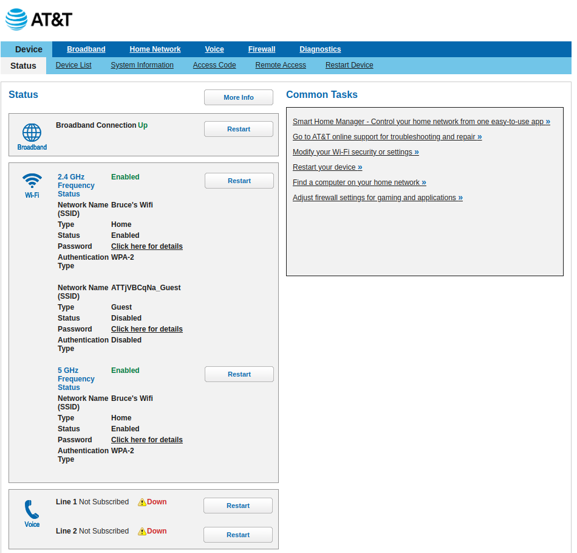
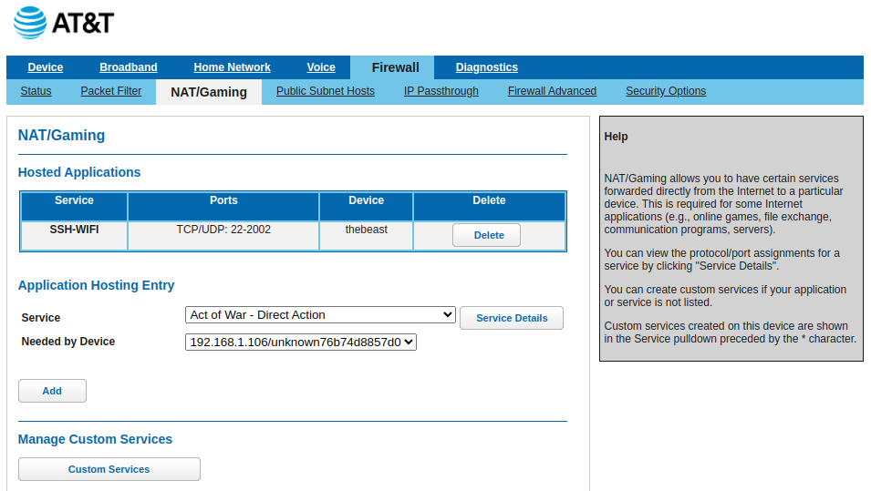

+++
title = 'How to SSH into your PC at home'
date = 2023-09-28T18:06:30-05:00
draft = false
+++

In this blog, I will introduce the method I use to ssh into my pc at home. I built my PC back in 2020 so that I would have a little more computing power at my fignertips when I need it. My hope was to avoid having to pay for cloud computing services for my deep learning and CUDA projects. Being someone who enjoys working at a library, I would like to be able to connect to my PC remotely. However, I found that it is a little bit more complicated than just installing openssh-server on the PC. It turns out I also need to assign port forwarding to my PC so that the router knows which device to forward the request to.

In general, to assign port forwarding, you will need to take the following actions:

- Access your router's admin page by logging in.
- Navigate to the section designated for adding a service.
- Choose or input the port number for incoming requests.
- Select or enter the private IP address of your host machine.
- Save and update the settings to apply the changes.

Here are some examples from an AT&T router.

